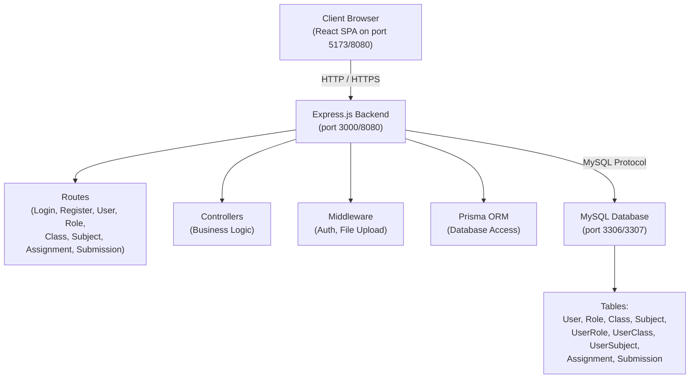
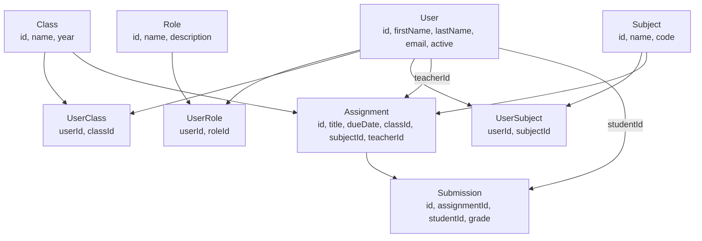

# SmartSubmit - Assignment Management System

**Live Demo:** http://79.76.119.73:8080

## Table of Contents

1. [Project Overview](#project-overview)
2. [Features](#features)
3. [Technology Stack](#technology-stack)
4. [System Architecture](#system-architecture)
5. [Installation & Setup](#installation--setup)
6. [Development Guide](#development-guide)
7. [Deployment](#deployment)
8. [User Guide](#user-guide)
9. [API Documentation](#api-documentation)
10. [Database Schema](#database-schema)
11. [Troubleshooting](#troubleshooting)
12. [Contributing](#contributing)

---

## Project Overview

SmartSubmit is a modern web-based assignment management system designed for educational institutions. It enables teachers to create and manage assignments, students to submit their work, and administrators to manage the entire system.

### Key Goals

- Streamline assignment distribution and submission
- Provide role-based access control (Admin, Teacher, Student)
- Enable efficient file management and tracking
- Offer a multilingual interface (German and English)

### Project Information

- **Type:** Diploma Thesis Project
- **Institution:** HTL Bulme
- **Status:** Active Development
- **License:** Educational Use

---

## Features

### Admin Features

- User management (bulk import via Excel)
- Import students and teachers from Excel files
- System configuration and monitoring
- Role assignment and permissions
- First-time setup wizard

### Teacher Features

- Create assignments with file attachments
- Set deadlines and assign to classes
- View assignment submissions
- Grade submissions and provide feedback
- Track submission statistics
- Manage multiple classes and subjects

### Student Features

- View assigned tasks
- Submit assignments with file uploads
- Track submission history
- View grades and feedback
- View assignment details and deadlines
- Filter assignments by class and subject

### General Features

- Google OAuth 2.0 integration for seamless login (automatically assigns 'Student' role to new users)
- Multilingual support (DE and EN)
- Responsive design (mobile-friendly)
- Secure authentication with JWT
- File upload support (multiple formats)
- Docker deployment ready

---

## Technology Stack

### Frontend

- **Framework:** React 18
- **Build Tool:** Vite
- **Styling:** Bootstrap 5, Custom CSS
- **HTTP Client:** Axios
- **Routing:** React Router DOM
- **State Management:** React Context API

### Backend

- **Runtime:** Node.js 20
- **Framework:** Express.js 5
- **ORM:** Prisma 6
- **Database:** MySQL 8
- **Authentication:** JWT (jsonwebtoken)
- **Password Hashing:** bcryptjs
- **File Upload:** Multer
- **Excel Processing:** xlsx

### DevOps

- **Containerization:** Docker, Docker Compose
- **Database Management:** Prisma Studio
- **Development:** Nodemon, Vite Dev Server
- **Version Control:** Git

---

## System Architecture

### High-Level Architecture



### Project Structure

```mermaid
graph TD
    A[SmartSubmit]

    %% Frontend
    A --> B[frontend]
    B --> B1[src]
    B1 --> B11[pages]
    B11 --> B111[login.jsx]
    B11 --> B112[register.jsx]
    B11 --> B113[admin.jsx]
    B11 --> B114[teacher.jsx]
    B11 --> B115[student.jsx]

    B1 --> B12[context]
    B12 --> B121[LanguageContext.jsx]

    B1 --> B13[i18n]
    B13 --> B131[index.js]

    B1 --> B14[App.jsx]
    B1 --> B15[main.jsx]

    B --> B2[public]
    B --> B3[package.json]
    B --> B4[vite.config.js]

    %% Backend
    A --> C[backend]
    C --> C1[src]

    C1 --> C11[contRollrs]
    C11 --> C111[login.controller.js]
    C11 --> C112[register.controller.js]
    C11 --> C113[admin.controller.js]
    C11 --> C114[teacher.controller.js]
    C11 --> C115[student.controller.js]

    C1 --> C12[main.js]
    C1 --> C13[app.config.js]
    C1 --> C14[app.routes.js]
    C1 --> C15[app.middleware.js]
    C1 --> C16[app.utils.js]

    C --> C2[prisma]
    C2 --> C21[schema.prisma]
    C2 --> C22[migrations]
    C2 --> C23[seed.js]

    C --> C3[uploads]
    C3 --> C31[assignments]

    C --> C4[package.json]
    C --> C5[.env]

    %% Root files
    A --> D[docker-compose.yml]
    A --> E[Dockerfile]
    A --> F[README.md]
```



---

## Installation & Setup

### Prerequisites

- Node.js 20.x or higher
- MySQL 8.0 or higher
- npm 10.x or higher
- Docker 24.x or higher (for containerized deployment)
- Git for version control

### Local Development Setup

#### 1. Clone the Repository

```bash
git clone https://github.com/htlbulme/smartsubmit.git
cd SmartSubmit
```

#### 2. Setup Backend

```bash
cd backend

# Install dependencies
npm install

# Create .env file
cp .env.example .env
# Edit .env with your database credentials and Google OAuth keys:
# DATABASE_URL="..."
# JWT_SECRET="..."
# GOOGLE_CLIENT_ID="..."
# GOOGLE_CLIENT_SECRET="..."
# GOOGLE_REDIRECT_URI="http://localhost:3000/api/auth/google/callback"

# Create MySQL database
mysql -u root -p
CREATE DATABASE smartsubmit;
CREATE USER 'your_user'@'localhost' IDENTIFIED BY 'your_password';
GRANT ALL PRIVILEGES ON smartsubmit.* TO 'your_user'@'localhost';
FLUSH PRIVILEGES;
EXIT;

# Run Prisma migrations
npx prisma generate
npx prisma migrate deploy

# Seed the database
npm run seed

# Start backend server
npm start
```

Backend will run on `http://localhost:3000`

#### 3. Setup Frontend

```bash
cd ../frontend

# Install dependencies
npm install

# Create .env file for development
echo "VITE_API_URL=http://localhost:3000" > .env.development

# Start development server
npm run dev
```

Frontend will run on `http://localhost:5173`

#### 4. Access the Application

Open your browser and navigate to:
- Frontend: `http://localhost:5173`
- Backend API: `http://localhost:3000/api`

**Default Admin Credentials:**
- Email: `admin@smartsubmit.com`
- Password: `admin123`

**Important:** Change the default password immediately after first login.

---

## Development Guide

### Running in Development Mode

#### Start Both Frontend and Backend

```bash
# Terminal 1: Backend
cd backend
npm start

# Terminal 2: Frontend
cd frontend
npm run dev
```

#### Or use Concurrent Mode

```bash
# From frontend directory
npm run dev
# This runs both frontend and backend simultaneously
```

### Database Management

#### View Database with Prisma Studio

```bash
cd backend
npx prisma studio
```

Opens browser at `http://localhost:5555` with visual database editor.

#### Create a New Migration

```bash
cd backend

# 1. Edit schema.prisma
# 2. Create migration
npx prisma migrate dev --name your_migration_name

# 3. Generate Prisma Client
npx prisma generate
```

#### Reset Database

```bash
cd backend

# Warning: This deletes all data
npx prisma migrate reset
```

### Adding New Features

#### 1. Add a New API Endpoint

**backend/src/controllers/example.controller.js:**
```javascript
const exampleFunction = async (req, res) => {
  try {
    // Your logic here
    res.json({ success: true, data: {} });
  } catch (error) {
    res.status(500).json({ success: false, message: 'Error' });
  }
};

module.exports = { exampleFunction };
```

**backend/src/app.routes.js:**
```javascript
const exampleController = require('./controllers/example.controller');

router.get('/example', authenticateToken, exampleController.exampleFunction);
```

#### 2. Add a New Frontend Page

**frontend/src/pages/example.jsx:**
```javascript
import { useState } from 'react';
import axios from 'axios';

const API_URL = import.meta.env.VITE_API_URL || "";

export default function Example() {
  const [data, setData] = useState(null);

  const fetchData = async () => {
    const token = localStorage.getItem('token');
    const response = await axios.get(`${API_URL}/api/example`, {
      headers: { Authorization: `Bearer ${token}` }
    });
    setData(response.data);
  };

  return (
    <div>
      <h1>Example Page</h1>
      <button onClick={fetchData}>Fetch Data</button>
    </div>
  );
}
```

**frontend/src/App.jsx:**
```javascript
import Example from './pages/example';

// Add route
<Route path="/example" element={<Example />} />
```

### Code Style Guidelines

- Use ES6+ features (const, arrow functions, async/await)
- Follow camelCase for variables and functions
- Use PascalCase for React components
- Add comments for complex logic
- Keep functions small and focused
- Handle errors properly with try-catch

---

## Deployment

### Docker Deployment (Recommended)

#### 1. Prepare Environment

Create `.env` file in the backend directory with your production credentials.

#### 2. Build and Deploy

```bash
# Build and start containers
docker compose build --no-cache
docker compose up -d

# Verify containers are running
docker compose ps

# Check logs
docker compose logs -f backend
```

#### 3. Access Application

- Application: `http://your-server-ip:8080`
- MySQL (external access): `your-server-ip:3307`

#### 4. Post-Deployment

1. Access the application
2. Login with default admin credentials
3. Change admin password immediately
4. Configure firewall to allow port 8080:
   ```bash
   sudo ufw allow 8080/tcp
   ```

### Production Server Setup

#### 1. Server Preparation

```bash
# Update system
sudo apt update && sudo apt upgrade -y

# Install Docker
curl -fsSL https://get.docker.com -o get-docker.sh
sudo sh get-docker.sh

# Install Docker Compose
sudo apt install docker-compose -y

# Enable Docker to start on boot
sudo systemctl enable docker

# Add user to docker group
sudo usermod -aG docker $USER
```

#### 2. Clone and Deploy

```bash
# Clone repository
git clone https://github.com/htlbulme/smartsubmit.git
cd SmartSubmit

# Create production .env with your credentials

# Deploy
docker compose build --no-cache
docker compose up -d
```

#### 3. Configure Firewall

```bash
# Allow HTTP
sudo ufw allow 8080/tcp

# Enable firewall
sudo ufw enable

# Check status
sudo ufw status
```

### Environment-Specific Configuration

#### Development (.env.development)

```env
VITE_API_URL=http://localhost:3000
```

#### Production (.env.production)

```env
VITE_API_URL=
```

Note: Empty value uses same origin (relative URLs)

---

## User Guide

### For Administrators

#### 1. First Login

1. Navigate to application URL
2. Click "Login"
3. Enter admin credentials
4. Change password immediately

#### 2. Import Students

Prepare Excel file with columns:
- firstName (First Name)
- lastName (Last Name)
- email (Email)
- class (Class, e.g., "5A" or multiple: "5A,5B")
- year (Year, e.g., 2025)

**Example:**

| firstName | lastName | email | class | year |
|---------|----------|-------|--------|----------|
| Max | Mustermann | max@school.com | 5A | 2025 |
| Anna | Schmidt | anna@school.com | 5B | 2025 |

Steps:
1. Go to Admin panel
2. Select "Students"
3. Click "Choose File" and select Excel
4. Click "Upload Data"

#### 3. Import Teachers

Prepare Excel file with columns:
- firstName (First Name)
- lastName (Last Name)
- email (Email)
- class (Class, optional)
- year (Year, optional)
- subject_code (Subject code, e.g., "MATH,DE")

Initial passwords: `firstnamelastname` (lowercase)

Example: Max Mustermann has password `maxmustermann`

Users must change password on first login.

### For Teachers

#### 1. Create Assignment

1. Login with teacher credentials
2. Select class from dropdown
3. Select subject
4. Enter assignment title
5. Write assignment description
6. Upload files if needed (PDF, DOCX, etc.)
7. Set deadline
8. Click "Save Assignment"

#### 2. View Assignments

1. Click "Assignment List" (Assignment List)
2. View all created assignments
3. See submission count
4. Check deadline status (active/expired)

#### 3. View Submissions

1. Find assignment in list
2. Click "Submissions"
3. View student submissions
4. Download submitted files

### For Students

#### 1. View Assignments

1. Login with student credentials
2. See all assignments for your classes
3. Filter by deadline or subject
4. View assignment details

#### 2. Submit Assignment

1. Click on assignment
2. Write submission text
3. Upload files if required
4. Click "Submit"
5. Confirmation message appears

#### 3. Track Submissions

1. Go to "My Submissions" (My Submissions)
2. View submission history
3. Check submission status
4. Download your submitted files

---

## API Documentation

### Authentication

All authenticated endpoints require JWT token in header:

```
Authorization: Bearer <token>
```

### Public Endpoints

#### Check Admin Exists

```http
GET /api/admin/check
```

Response:
```json
{
  "success": true,
  "adminExists": true
}
```

#### Register (First Admin Only)

```http
POST /api/register
Content-Type: application/json

{
  "email": "admin@example.com",
  "password": "password123",
  "roleId": 3
}
```

#### Login

```http
POST /api/login
Content-Type: application/json

{
  "email": "user@example.com",
  "password": "password123",
  "role": "Admin"
}
```

### Admin Endpoints

#### Import Students

```http
POST /api/admin/import/students
Authorization: Bearer <admin-token>
Content-Type: multipart/form-data

file: <excel-file>
```

#### Import Teachers

```http
POST /api/admin/import/teachers
Authorization: Bearer <admin-token>
Content-Type: multipart/form-data

file: <excel-file>
```

### Teacher Endpoints

#### Create Assignment

```http
POST /api/teacher/assignments
Authorization: Bearer <teacher-token>
Content-Type: multipart/form-data

class: "5A"
subject: "Mathematik"
title: "Homework 1"
text: "Complete exercises 1-10"
dueDate: "2025-12-31"
files: <file1>, <file2>
```

#### Get Teacher's Assignments

```http
GET /api/teacher/assignments
Authorization: Bearer <teacher-token>
```

### Student Endpoints

#### Get Assignments

```http
GET /api/student/assignments
Authorization: Bearer <student-token>
```

#### Submit Assignment

```http
POST /api/student/submit
Authorization: Bearer <student-token>
Content-Type: multipart/form-data

assignmentId: 1
text: "My submission"
files: <file1>, <file2>
```

### Utility Endpoints

#### Get Classes

```http
GET /api/classes
Authorization: Bearer <token>
```

#### Get Subjects

```http
GET /api/subjects
Authorization: Bearer <token>
```

---

## Database Schema

### Entity Relationship Diagram



### Table Descriptions

#### User

Stores all system users (admins, teachers, students).

| Column | Type | Description |
|--------|------|-------------|
| id | INT | Primary key |
| firstName | VARCHAR(255) | First name |
| lastName | VARCHAR(255) | Last name |
| email | VARCHAR(255) | Unique email address |
| passwordHash | VARCHAR(255) | Hashed password |
| provider | VARCHAR(50) | OAuth provider (optional) |
| oauthId | VARCHAR(255) | OAuth user ID (optional) |
| createdAt | DATETIME | Creation timestamp |
| active | BOOLEAN | Active status |

---

#### Role

Defines user roles in the system.

| Column | Type | Description |
|--------|------|-------------|
| id | INT | Primary key |
| name | VARCHAR(255) | Role name |
| description | TEXT | Role description |

---

#### Class

Stores school classes.

| Column | Type | Description |
|--------|------|-------------|
| id | INT | Primary key |
| name | VARCHAR(50) | Class name (e.g. "5A") |
| year | INT | School year |

**Unique constraint:** (name, year)

---

#### Subject

Stores school subjects.

| Column | Type | Description |
|--------|------|-------------|
| id | INT | Primary key |
| name | VARCHAR(255) | Subject name |
| code | VARCHAR(255) | Unique subject code |

---

#### UserRole

Many-to-many relation between users and roles.

| Column | Type | Description |
|--------|------|-------------|
| id | INT | Primary key |
| userId | INT | FK → User |
| roleId | INT | FK → Role |

**Unique constraint:** (userId, roleId)

---

#### UserClass

Many-to-many relation between users and classes.

| Column | Type | Description |
|--------|------|-------------|
| id | INT | Primary key |
| userId | INT | FK → User |
| classId | INT | FK → Class |

**Unique constraint:** (userId, classId)

---

#### UserSubject

Many-to-many relation between users and subjects.

| Column | Type | Description |
|--------|------|-------------|
| id | INT | Primary key |
| userId | INT | FK → User |
| subjectId | INT | FK → Subject |

**Unique constraint:** (userId, subjectId)

---

#### Assignment

Stores teacher-created assignments.

| Column | Type | Description |
|--------|------|-------------|
| id | INT | Primary key |
| title | VARCHAR(255) | Assignment title |
| description | TEXT | Assignment description |
| link | VARCHAR(1024) | External resource link |
| attachments | TEXT | JSON metadata of attachments |
| dueDate | DATETIME | Due date |
| archived | BOOLEAN | Archived status |
| classId | INT | FK → Class |
| subjectId | INT | FK → Subject |
| teacherId | INT | FK → User (teacher) |
| createdAt | DATETIME | Creation timestamp |

---

#### Submission

Stores student submissions.

| Column | Type | Description |
|--------|------|-------------|
| id | INT | Primary key |
| assignmentId | INT | FK → Assignment |
| studentId | INT | FK → User (student) |
| files | TEXT | JSON file metadata |
| text | TEXT | Optional text submission |
| submittedAt | DATETIME | Submission timestamp |
| grade | INT | Grade (0–100) |
| feedback | TEXT | Teacher feedback |

**Unique constraint:** (assignmentId, studentId)

---

## Troubleshooting

### Common Issues

#### 1. Port Conflicts

**Problem:** Port 3306 already in use

**Solution:**
```bash
# For local development: Change Docker MySQL port
# Edit docker-compose.yml:
ports:
  - "3307:3306"  # Use 3307 externally
```

#### 2. Prisma Client Not Generated

**Problem:** Cannot find module '@prisma/client'

**Solution:**
```bash
cd backend
npx prisma generate
npm start
```

#### 3. Upload Fails in Docker

**Problem:** Server error when uploading files

**Solutions:**
- Check frontend API URL is correct (empty for Docker)
- Rebuild frontend: `npm run build`
- Rebuild Docker: `docker compose build --no-cache`
- Clear browser cache and login again

#### 4. Database Connection Failed

**Problem:** Can't reach database server

**Solution:**
```bash
# Check database is running
docker compose ps

# Check logs
docker compose logs db

# Restart database
docker compose restart db
```

#### 5. 403 Forbidden on Admin Routes

**Problem:** Admins only error

**Solution:**
- Create admin user in Docker database
- Login again to get fresh token
- Check admin role exists in database

### Docker Issues

#### Container Keeps Restarting

Check logs:
```bash
docker compose logs backend --tail 100
```

Common causes:
- Database connection failed
- Prisma Client not generated
- Port already in use

#### Build Fails

Clear Docker cache:
```bash
docker compose down
docker system prune -af
docker compose build --no-cache
docker compose up -d
```

### Frontend Issues

#### Blank Page After Build

Check console for errors:
1. Open browser DevTools (F12)
2. Check Console tab for errors
3. Common issues:
   - Missing API_URL
   - CORS errors
   - Build errors

#### API Requests Fail

Check Network tab:
1. Open DevTools (F12) → Network tab
2. Try the action that fails
3. Check request URL, status code, and response

---

## Contributing

### Development Workflow

1. Fork the repository
2. Create feature branch: `git checkout -b feature/your-feature-name`
3. Make changes
4. Test thoroughly in both development and Docker
5. Commit changes: `git commit -m "Add: your feature description"`
6. Push to your fork: `git push origin feature/your-feature-name`
7. Create Pull Request

### Code Review Checklist

- Code follows project style guidelines
- All tests pass
- No console.log in production code
- Error handling implemented
- Comments added for complex logic
- Documentation updated
- No sensitive data in code
- Works in both development and Docker

### Testing

Before submitting:

```bash
# Test backend
cd backend
npm test

# Test frontend build
cd frontend
npm run build

# Test Docker deployment
docker compose build --no-cache
docker compose up -d
docker compose logs backend
```

---

## License

This project is developed as a diploma thesis for educational purposes at HTL Bulme.

For educational use only. Commercial use is not permitted without permission.

---

## Contact & Support

### Project Team

- **Institution:** HTL Bulme
- **Project Type:** Diploma Thesis
- **Repository:** https://github.com/htlbulme/smartsubmit

### Getting Help

1. Check Documentation: Read this README and troubleshooting section
2. Check Issues: Search existing GitHub issues
3. Create Issue: If problem persists, create new issue with detailed description, steps to reproduce, error messages, and environment details

### Reporting Bugs

Include:
- Expected behavior
- Actual behavior
- Steps to reproduce
- Screenshots if applicable
- Error logs
- System information

---

## Changelog

### Version 1.0.0 (Current)

**Features:**
- User authentication and authorization
- Role-based access control
- Admin panel with Excel import
- Teacher assignment creation
- Student assignment viewing
- Student submissions (text + file upload) incl. submission overview
- Teacher grading and feedback for submissions
- File upload support
- Persistent upload storage in Docker (uploads via volume)
- Multilingual interface (DE, EN)
- Docker deployment
- Responsive design

**Known Limitations:**
- Email notifications (planned)
- Advanced reporting (planned)

---

## Acknowledgments

- HTL Bulme for project support
- Prisma for excellent ORM
- React and Vite teams
- Express.js community
- All contributors and testers

---

**Last Updated:** January 2026  
**Version:** 1.0.0  
**Status:** Active Development
